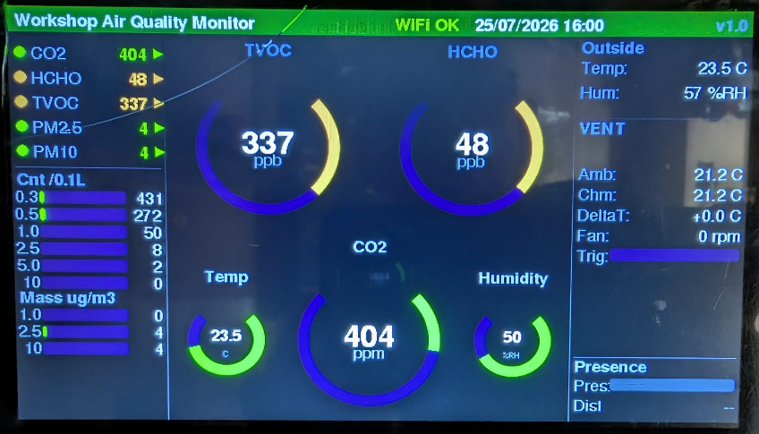

# Workshop Environment Monitor (WEM)

An open-source ESP32-S3 based air quality and environmental monitor, built for workshops where 3D printing, soldering, and other fume-producing work happens in an enclosed space.

WEM is a modular design - fit what you need that continuously measures CO2, TVOC, HCHO (formaldehyde), particulates (PM0.3/0.5/1.0/2.5/10), temperature, and humidity, displays live readings on a 7" touchscreen (if fitted), and publishes everything to [Home Assistant](https://www.home-assistant.io/) (if available) over MQTT for logging, automation, and alerting.

This project exists because 3D printing ABS and soldering in a workshop produces measurable off-gassing and fumes — WEM was built to quantify that, and to benchmark a custom venting system against real data rather than guesswork.



---

## Status

**This repository currently contains the hardware design files and vendored libraries only. Firmware source code is not yet published** — it's undergoing a final review pass before being committed. A `USER_GUIDE.md` covering build, flash, first-boot, and configuration instructions will be added alongside the firmware.

If you've found this repo before that happens: watch/star it, or check back soon.

---

## What it monitors

| Sensor | Measures | Interface |
|---|---|---|
| SGP30 | TVOC (total volatile organic compounds) | I2C |
| SFA40 | HCHO (formaldehyde) | UART |
| SCD40 | CO2 | I2C |
| SHT40 | Temperature / humidity (primary) | I2C |
| BME280 | Temperature / humidity (secondary, HA-only) | I2C |
| PMS5003 | Particulates (PM1.0 / PM2.5 / PM10) | UART |
| LD2410B | mmWave presence detection (optional) | UART |

WEM uses an **optional-sensor design pattern** — every sensor above can be omitted from a build without editing firmware. Absent sensors are detected automatically at boot and gracefully excluded from the display, alarms, and Home Assistant publishing. This means you can build a lower-cost version of WEM with only the sensors that matter to you.

Readings are shown on a 7" 800×480 SSD1963 TFT touchscreen (if fitted) with live gauges, and published to Home Assistant via [ArduinoHA](https://github.com/dawidchyrzynski/arduino-home-assistant) over MQTT.

---

## Repository structure

```
├── hardware/            PCB design files (Gerbers), hardware licence, breakout-board
│                        references (photos/links being added post-launch)
├── Libraries/           Full vendored copies of every Arduino library WEM depends on,
│                        exactly as used to build and test this project
├── stl for printing/    3D-printable enclosure and sensor mount STL files
├── LICENSE              Firmware licence (AGPL-3.0-or-later)
├── THIRD_PARTY_LICENSES.md   Full attribution and licence text for every dependency
└── secrets.h.example    Template for your own WiFi/MQTT credentials
```

---

## Building the PCB

Gerber files for the WEM main PCB are in [`hardware/`](hardware). To get boards made:

1. Download the Gerber `.zip` from `hardware/`.
2. Upload it directly to a fab house's quoting page — [JLCPCB](https://jlcpcb.com/).
3. Default settings (1.6mm thickness, HASL finish, 1oz copper) match what this design was built and tested with; nothing exotic is required.

Breakout-board module links and assembly photos are being put together for a launch video and will be added to `hardware/` shortly after release — see the note in that folder.

---

## Licensing

- **Firmware**: [AGPL-3.0-or-later](LICENSE) — required because WEM links against ArduinoHA, which is itself AGPL-3.0. See [`THIRD_PARTY_LICENSES.md`](THIRD_PARTY_LICENSES.md) for the full rationale and every dependency's licence.
- **Hardware (PCB + enclosure)**: [CERN-OHL-W-2.0](hardware/LICENSE-hardware.txt).

Full attribution for every third-party library, with verbatim licence text, is in [`THIRD_PARTY_LICENSES.md`](THIRD_PARTY_LICENSES.md).

---

## Why "Workshop" Environment Monitor?

Built to answer a simple question: is my workshop air actually safe to breathe while I'm printing ABS or soldering, and does my venting setup actually help? WEM logs real numbers to Home Assistant so that question has a real answer instead of a guess.

---

## Acknowledgements

Built with [ArduinoHA](https://github.com/dawidchyrzynski/arduino-home-assistant), [TFT_eSPI](https://github.com/Bodmer/TFT_eSPI), and sensor libraries from Adafruit and Sensirion. Full credits in [`THIRD_PARTY_LICENSES.md`](THIRD_PARTY_LICENSES.md).
