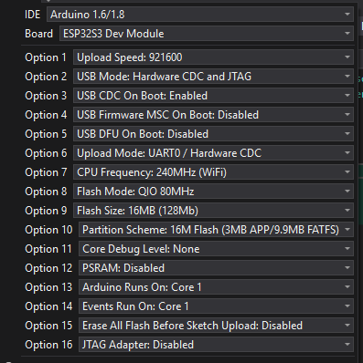

SPDX-License-Identifier: CC-BY-SA-4.0
SPDX-FileCopyrightText: 2026 Kevin Guest (BionicBone)

# Workshop Environment Monitor — User Guide

**Project home:** <https://github.com/bionicbone/Workshop-Environment-Monitor>

This guide covers getting a fresh WEM running and keeping it that way:
compiling and flashing the firmware, first boot, day-to-day touchscreen
controls, what the hardware looks like under the hood, and what to do when
something looks wrong. For licensing, third-party attribution, and repository
structure, see `README.md` in the repository root (link above).

This document describes WEM as built at **v1.0.0**, and covers the device as
it is — not how it came to be that way. The development history isn't
published.

---

## 1. Building, Flashing and First Boot

### 1.1 Building and flashing the firmware

v1.0.0 is a **compile-it-yourself release** — there's no pre-built binary to
download. A compiled WEM image has your WiFi and MQTT credentials baked into
it, so a shared binary would either leak them or be useless to anyone else.
You build it yourself against your own `secrets.h`. (A way to enter
credentials on the device at first boot is planned as a fast-follow; once that
exists, pre-built binaries can be published too.)

**What you need**

- The **Arduino IDE** (1.8.x or 2.x). WEM is developed in Visual Studio with
  the Visual Micro extension, but it builds unmodified in the standard Arduino
  IDE, and the settings below map directly onto the Arduino IDE **Tools** menu.
- The **ESP32 Arduino core** ("esp32" by Espressif Systems), installed through
  **Boards Manager**. WEM is tested on core **v2.0.17** and **v3.3.10** —
  either works. On any other version the firmware still runs, but the boot log
  prints a "core version has not been tested" line.
- The repository contents: the sketch folder, `secrets.h.example`, and the
  `Libraries/` folder.

**Step 1 — use the vendored libraries (don't skip this).** The repository's
`Libraries/` folder holds the exact copies of every library WEM was built and
tested against. **Use these rather than installing from the Library Manager.**
Copy each folder from `Libraries/` into your Arduino sketchbook `libraries/`
directory (usually `Documents/Arduino/libraries/`), replacing any existing
copy of the same name, then restart the IDE.

This matters most for **TFT_eSPI**, which is pre-configured for WEM's exact
800×480 SSD1963 panel. The firmware checks this at compile time and stops with

```
#error "Incorrect TFT_eSPI Display Setup - should be 50"
```

if it's built against a stock TFT_eSPI. The vendored copy is already set to
display setup 50, so with it this never fires.

**Step 2 — create your `secrets.h`.** Copy `secrets.h.example` to `secrets.h`
in the sketch folder and fill in your WiFi SSID and password, and your MQTT
broker address, port and credentials. `secrets.h` is git-ignored and must
never be committed — it's the one file holding your credentials, and keeping
it out of version control is what makes the compile-it-yourself model safe.

**Step 3 — select the board and settings.** Set **Board** to **ESP32S3 Dev
Module**, then match every option below. These are the exact settings WEM is
built and tested with.

| Setting | Value |
|---|---|
| Upload Speed | 921600 |
| USB Mode | Hardware CDC and JTAG |
| USB CDC On Boot | Enabled |
| USB Firmware MSC On Boot | Disabled |
| USB DFU On Boot | Disabled |
| Upload Mode | UART0 / Hardware CDC |
| CPU Frequency | 240MHz (WiFi) |
| Flash Mode | QIO 80MHz |
| Flash Size | 16MB (128Mb) |
| Partition Scheme | 16M Flash (3MB APP/9.9MB FATFS) |
| Core Debug Level | None |
| PSRAM | **Disabled** |
| Arduino Runs On | Core 1 |
| Events Run On | Core 1 |
| Erase All Flash Before Sketch Upload | Disabled |
| JTAG Adapter | Disabled |



Two of these are not optional:

- **PSRAM must be Disabled.** WEM uses GPIO35 and GPIO36, which on this module
  sit on the octal-PSRAM bus (see the pin map in 4.5). Enabling PSRAM takes
  those pins over and the build won't work correctly.
- **Flash Size 16MB with the 16M (3MB APP / 9.9MB FATFS) partition.** The
  firmware is built to this layout; a smaller flash size or a different
  partition scheme can fail to upload or leave no room for the FATFS area.

**USB CDC On Boot: Enabled** is why the serial monitor works over the same
USB-C cable you flash with — no separate USB-serial adapter needed.

**Step 4 — compile and upload.** Connect the board over USB-C, select its port
under **Tools → Port**, and click **Upload**. If the board isn't detected or
the upload won't start, hold the **BOOT** button, tap **RESET** (or re-plug the
cable), release **BOOT**, and try again — some ESP32-S3 boards need this to
enter the bootloader for a first flash.

**Step 5 — confirm it's running.** Open the **Serial Monitor at 115200 baud**.
You should see the boot banner:

```
Name        : Workshop Environment Monitor
Program     : v1.0.0
License     : AGPL-3.0-or-later, NO WARRANTY
Source      : https://github.com/bionicbone/Workshop-Environment-Monitor
```

followed by the Arduino core version and a line for each sensor as it's probed
(for example `SHT40: Found and initialised`, or `SHT40: Sensor not found at
0x44!` for anything not fitted). A display-fitted unit also logs the touch
controller at `0x38`. "This ESP32 Arduino Core version has not been tested"
just means you're not on v2.0.17 or v3.3.10 — the firmware still runs.

> **Getting diagnostic logs.** The release build ships with `DEBUG 0` in
> `Global.h`, so normal operation is quiet apart from the boot banner. If
> you're chasing a problem or filing an issue, set `DEBUG 1`, re-flash, and
> capture the serial output — that detailed log is the thing worth attaching
> to a bug report.

### 1.2 Before you power on

By this point you've built and flashed the firmware (1.1), so `secrets.h` is
already in place. Before the first power-up:

- Confirm every sensor you intend to fit is connected — WEM auto-detects
  what's present at boot (see [Optional Sensors](#5-optional-sensors)), so a
  loose connector just means that sensor sits out, not a crash.
- If you're powering from the 19V mains PSU, double-check polarity at the
  barrel connector before first power-up.

### 1.3 What happens on first boot

1. WEM checks whether a display is fitted. If one is, it initialises and
   shows a splash screen — project name, version, source link, licence and
   a short disclaimer — which stays up for the rest of boot. If not, WEM
   runs headless and publishes to Home Assistant only — see
   [Running Without a Display](#6-running-without-a-display-headless).
2. WEM attempts to connect to WiFi (a few retries, then continues in a
   degraded/offline state rather than hanging — it'll pick the connection up
   automatically later if it appears). On a display-fitted unit, a "WiFi"
   line is added to the splash screen once this finishes, showing whether it
   connected.
3. If WiFi connects, MQTT and Home Assistant discovery follow, along with
   NTP time sync and OTA readiness.
4. Each sensor is probed, with up to 3 seconds of retries before WEM gives up
   on it — a slow-to-wake sensor gets a fair chance rather than being written
   off on one failed attempt. Anything that still doesn't answer is marked
   absent for the rest of the session: its gauge/row greys out permanently
   rather than freezing on stale data. No firmware changes are needed to run
   with a subset of sensors. Expect boot to take noticeably longer when
   sensors are missing — that's the retry windows elapsing, not a fault. On a
   display-fitted unit, each sensor is added to the splash screen's list as
   it's probed, so a long boot is visibly progressing rather than looking
   frozen. **The HCHO sensor (SFA40) doesn't appear in this list** — it's a
   passive UART stream with no boot-time check to report, so there's nothing
   to show yet at this point; see [Optional Sensors](#5-optional-sensors).
5. **The SGP30 (TVOC) sensor starts a warm-up period** before it publishes
   real numbers — 12 hours on a genuinely fresh start, or 1 hour if a
   previously-saved baseline was restored from flash. This is normal and
   expected of the sensor itself, not a fault.
6. Once every step above has finished, a display-fitted unit holds the
   completed splash screen briefly, then switches to the normal dashboard.
   From here on the display behaves as described in
   [section 2](#2-touchscreen-controls) onward.

### 1.4 First boot in a new or freshly-printed enclosure

If your WEM enclosure was just 3D printed, or you've just finished soldering
nearby, don't let the SGP30 form its first calibration baseline while
sitting in that off-gassing air — it will bake the fumes into its reference
point and under-report real contamination afterwards. This is the single
most important thing to get right on a first build, and it only takes a few
minutes of thought before you power on.

**Step 1 — ask yourself: was this build near fresh off-gassing sources?**
This includes a freshly-printed enclosure (ABS/PETG/PLA all off-gas for a
while after printing, ABS particularly), solder fumes from assembling the
PCB, or strong VOCs nearby (paint, solvent, adhesives, new foam packaging)
in the hours before first power-up.

- **No, none of that applies** (an already-aired-out enclosure, board
  assembled a while ago, normal workshop air) → power on and let the
  standard 12h warm-up gate run as-is. Nothing further needed — skip to
  [section 2](#2-touchscreen-controls).
- **Yes, or you're not sure** → follow the procedure below.

**Step 2 — the recommended procedure:**

1. **Power on and let the enclosure/board air out somewhere well
   ventilated first** — outdoors or by an open window, for a few hours if
   possible. The display and other sensors work normally during this time;
   only the SGP30's calibration is at risk.
2. **Then start the 12h warm-up "for real"** once the air around the unit
   is back to normal. You don't need to do anything to "start" it — just
   make sure the SGP30 forms its baseline breathing normal air, not fresh
   off-gassing.
3. **If you skipped step 1** — you powered on directly in a contaminated
   environment, or you're unsure whether the warm-up window already
   overlapped with off-gassing — **clear the SGP30 baseline** (see
   [section 3](#3-clearing-the-sgp30-baseline-nvs-reset)) once the air has
   settled. This discards whatever baseline was forming and restarts a
   clean 12h window. It's quick (a 5-second touch long-press) and doesn't
   touch your WiFi/MQTT configuration.

**This only affects the SGP30 (TVOC/eCO2).** The other sensors don't hold a
calibration baseline and need no special first-boot handling — CO2, HCHO,
temperature, humidity, and particulates all read normally from the first
boot regardless of the environment.

When genuinely unsure which path applies, **step 3 (clear the baseline) is
always the safe default** — there's no harm in clearing a baseline that
didn't need clearing, but there's no way to un-bake a contaminated one
short of clearing it.

---

## 2. Touchscreen Controls

> These controls need a display fitted — the touch sensor lives on the
> display's own ribbon. If you're running headless, see
> [Running Without a Display](#6-running-without-a-display-headless) for what
> you lose and what to do instead.

| Action | Effect |
|---|---|
| Short tap | Wakes the display from backlight sleep, or snoozes an active alarm |
| Hold for 5 seconds | Clears the stored SGP30 baseline and reboots (see below) |

The long-press is confirmed by a distinct tone (four short beeps + one long
beep) — different from the two-beep alarm pattern, so you can tell them
apart without looking at the screen. The unit then reboots automatically
once the tone finishes **and** your finger has lifted off the screen.

---

## 3. Clearing the SGP30 Baseline (NVS Reset)

### Why you'd want to do this

The SGP30 saves its calibration baseline to flash (NVS) roughly once an
hour, and restores it on every boot so it doesn't have to fully recalibrate
after a normal power cycle. That saved baseline is tied to the **physical
chip** it came from. You should clear it whenever:

- **You've replaced the physical SGP30** — restoring an old chip's baseline
  onto a new one produces plausible-looking but wrong readings (commonly
  seen as TVOC/eCO2 reading flat or stuck). Clear it *before* trusting the
  new sensor, not after you've noticed bad data.
- **First boot happened in a contaminated environment** (see 1.4 above).
- Readings look implausibly flat or pinned and you suspect a bad baseline.

### How to clear it

**Recommended — long-press the touchscreen for 5 seconds.** Hold until you
hear the confirmation tone (four short beeps, one long beep), then release.
The unit reboots automatically and starts a fresh calibration window. This
is quick, doesn't touch your WiFi/MQTT settings, and is the only method most
users will ever need.

**Fallback — full flash erase.** Only necessary if the long-press mechanism
itself is unavailable — which currently includes every headless build (see
[Running Without a Display](#6-running-without-a-display-headless)), as well
as a display fault. This wipes *everything* in flash, including your WiFi and
MQTT credentials — you'll need to reconfigure `secrets.h` and reflash
afterwards.

> If you're running headless and this looks like a lot of ceremony just to
> reset one sensor — agreed. A Home Assistant button for this is the next
> thing on the list after release.

---

## 4. Hardware Reference

### 4.1 Sensor summary

| Sensor | Measures | Interface | Voltage | Read cadence | HA publish rate |
|---|---|---|---|---|---|
| SGP30 | TVOC / eCO2 | I2C (0x58) | 3.3V | Every 1s (sensor requirement) | ~every 30s |
| SFA40 | HCHO (formaldehyde) | UART | 5V | Every loop (UART-driven) | ~every 30s |
| SCD40 | CO2 | I2C (0x62) | 5V | Every 5s | ~every 30s |
| SHT40 | Temperature / humidity (primary, drives the display) | I2C (0x44) | 5V | Every 5s | ~every 30s |
| BME280 | Temperature / humidity (secondary, HA-only) | I2C (0x76) | 3.3V | Every 5s | ~every 30s |
| PMS5003 | Particulates — 6 count channels + 3 mass concentrations (see 4.2) | UART | 5V | 120s duty cycle (25% on-time) | ~every 120s |
| LD2410B | mmWave presence (optional) | UART | 5V (3.3V logic) | Continuous | — (local use only) |
| FT5x06 | Capacitive touch | I2C (0x38) | 3.3V | Continuous | — |

The FT5x06 does double duty: WEM also uses its presence on the I2C bus to work
out whether a display is fitted at all. See
[Running Without a Display](#6-running-without-a-display-headless).

**The 7" TFT display panel itself runs on 5V** (with 3.3V logic and a 3.3V
backlight-enable input). Only the FT5x06 touch controller listed above is a
3.3V part — the panel is not. This matters when ordering: these 7" 800x480
modules are commonly sold in both 3.3V and 5V variants, and WEM is built for
the **5V** version. Order the 5V variant — the 3.3V one is not a drop-in
substitute on this board.

Sensor reads happen at the cadence each sensor's own hardware needs; Home
Assistant publishing is decoupled from that and rate-limited separately, so
HA doesn't get flooded with near-duplicate values.

A sensor that isn't fitted is simply skipped — no reads attempted, no
gauge/entity populated, no crash. See [Optional Sensors](#5-optional-sensors).

### 4.2 Particulate channels — counts vs mass

The PMS5003 reports particulates two different ways, and WEM publishes both.
They are not interchangeable and the distinction matters:

| Channel | Unit | What it is |
|---|---|---|
| PM0.3 / PM0.5 / PM1.0 / PM2.5 / PM5.0 / PM10 **Count** | cnt/0.1L | How *many* particles of at least that size were counted in a 0.1 litre sample |
| PM1.0 / PM2.5 / PM10 **Atmospheric** | ug/m3 | Estimated *mass* of particulate matter suspended per cubic metre |

All nine appear on the display's left-hand panel and as separate Home
Assistant entities.

**Why the small counts matter.** PM0.3 and PM0.5 are the channels worth
watching for 3D printing. Ultrafine particles emitted while printing are
numerous but individually almost weightless, so they can be present in very
large numbers while the mass figures still read near zero — a monitor that
only reported ug/m3 would tell you the air was fine. The count channels are
there so it doesn't.

> **Alarms use the mass figures only** — PM2.5 and PM10 in ug/m3, never the
> counts. The count channels are informational: there's no widely-agreed
> health threshold to alarm against, and a raw particle count varies far too
> much with normal workshop activity to make a sensible trigger. See
> [Alarms and Thresholds](#7-alarms-and-thresholds).

### 4.3 I2C bus (Wire1 — SDA on GPIO1, SCL on GPIO4)

| Address | Device | Sensor |
|---|---|---|
| 0x38 | FT5x06 | Capacitive touch |
| 0x44 | SHT40 | Temperature / humidity |
| 0x58 | SGP30 | TVOC / eCO2 |
| 0x62 | SCD40 | CO2 / temp / humidity |
| 0x76 | BME280 | Temp / humidity / pressure |

### 4.4 UART connections

| Interface | Device | Baud |
|---|---|---|
| Serial0 | LD2410B (mmWave presence) | 256000 |
| Serial1 | SFA40 (HCHO) | 9600 |
| Serial2 | PMS5003 (particulates) | 9600 |

### 4.5 GPIO pin map (ESP32-S3)

| GPIO | Function | Notes |
|---|---|---|
| 1 | I2C1 SDA | Shared sensor bus (Wire1) |
| 2 | Touch interrupt | FT5x06 |
| 3 | TFT write strobe | Parallel display interface |
| 4 | I2C1 SCL | Shared sensor bus (Wire1) |
| 5–8, 15–18 | TFT data bus (D0–D7) | 8-bit parallel display interface |
| 10 | Backlight control | HIGH = on, LOW = off |
| 21 | PMS5003 RX (Serial2) | Particulate sensor |
| 35 | PMS5003 TX (Serial2) | Particulate sensor |
| 36 | Oscilloscope test point | Debug only — not required for normal use |
| 38 | SFA40 TX (Serial1) | HCHO sensor |
| 39 | LD2410B RX (Serial0) | Presence sensor |
| 40 | LD2410B TX (Serial0) | Presence sensor |
| 41 | LD2410B presence output | Direct digital read |
| 42 | SFA40 RX (Serial1) | HCHO sensor |
| 47 | Buzzer PWM | Drives alert piezo via transistor |
| 48 | TFT D/C | Data/command select |

GPIO 19, 20 (USB), 33–34 (PSRAM traces), 43, 44 (USB serial) are reserved by
the board itself — don't repurpose them if you're modifying the PCB. GPIO
35–37 sit on PSRAM traces too, but PSRAM is disabled in this build's compiler
settings, which frees them — hence 35 and 36 appearing in the table above.
GPIO 9, 11, 12, 13 and 14 are genuinely unallocated if you need a spare.

### 4.6 Power

| Rail | Source |
|---|---|
| 19V | External mains PSU (barrel connector) |
| 5V | On-board switching regulator, from 19V |
| 3.3V | ESP32-S3 dev board's own regulator, from 5V |

WEM can also run from USB power alone (5V) for bench testing, but the 19V
input is recommended for permanent installs.

---

## 5. Optional Sensors

Every sensor in the table above is optional. WEM probes each one at boot,
retrying for up to 3 seconds before giving up; anything not fitted (or not
responding) is marked absent for that session and cleanly excluded from:

- the display (its gauge/row greys out rather than showing stale data),
- Home Assistant (no entity ever gets pushed for a sensor that never
  answered),
- alarm logic (an absent sensor can never trigger a false alarm).

This means you can build a cut-down WEM with only the sensors that matter to
you — no firmware changes required either way.

**The display is optional on the same terms**, with one difference worth
knowing about: leaving it off costs you the alarm snooze and the SGP30
baseline reset, because both are triggered by touch. See
[Running Without a Display](#6-running-without-a-display-headless).

---

## 6. Running Without a Display (Headless)

The 7" touchscreen is optional, just like the sensors. Leave it off and WEM
runs headless: every sensor is read as normal and everything is published to
Home Assistant exactly as it would be otherwise. If you already live in the HA
dashboard, or you're mounting WEM somewhere nobody will look at it, this is a
perfectly sensible way to build one — and it's cheaper.

No firmware changes or build flags are needed. Just don't connect the display.

### 6.1 How WEM knows

WEM looks for the touch controller on the I2C bus at boot. Found means a
display is fitted; not found means headless. You'll see one of these in the
serial log:

```
TFT: Touch controller found at 0x38 - display fitted
```

```
TFT: Touch controller not found at 0x38 - display assumed NOT fitted
TFT: Running WITHOUT display (Home Assistant only).
```

This check runs once, at boot. **Connecting a display to a running WEM won't
do anything until you restart it.**

**One thing to watch:** the display panel itself can't be detected directly —
there's no electrical path to ask it whether it's there. WEM asks the touch
controller instead, which shares the display's ribbon cable. So if the touch
ribbon isn't fully seated, WEM will decide there's no display and leave the
screen dark, even though the panel is physically connected. **If you've fitted
a display and the screen stays black, reseat the touch ribbon first** — it's
by far the most likely cause.

### 6.2 What you give up

Everything you lose comes from the same root: no display means no touchscreen,
and touch is currently WEM's only input.

| | Headless |
|---|---|
| Sensor readings | Full — unchanged |
| Home Assistant / MQTT | Full — unchanged |
| OTA firmware updates | Full — unchanged |
| Audible alarm | Sounds normally — **but cannot be silenced** |
| Alarm snooze | Not available |
| SGP30 baseline reset | Not available (flash erase only) |
| On-screen gauges, backlight | Not applicable |

Two of those deserve spelling out.

**The alarm can't be snoozed.** It will sound its two-beep pattern every few
seconds for as long as the reading stays over threshold. There's no way to
silence it from the device. This bites hardest if you also skipped the LD2410B
presence sensor, because then the alarm isn't gated on someone being in the
room either — it'll sound whether you're there or not. Two practical options
in the meantime: fit an LD2410B (cheap, and it gates the alarm on presence),
or fix the underlying air quality, which is admittedly the point of the device.

**The SGP30 baseline can't be cleared.** The 5-second long-press described in
[section 3](#3-clearing-the-sgp30-baseline-nvs-reset) needs a touchscreen. On
a headless unit your only route is a full flash erase and reflash. This mainly
matters if you ever swap the physical SGP30 chip — see section 3 for why that
requires a baseline clear.

> **Both of these are known v1.0.0 limitations, not permanent design.**
> Exposing snooze and baseline reset as Home Assistant buttons is the first
> thing planned after release — it needs no touchscreen and will work on every
> build, headless or not. If headless operation matters to you, it's worth
> watching <https://github.com/bionicbone/Workshop-Environment-Monitor> for that update.

---

## 7. Alarms and Thresholds

WEM raises an audible alarm (piezo buzzer) and a visual warning on the
display when a reading crosses its threshold. Thresholds are chosen to flag
"you should probably act on this now", not raw sensor limits:

| Reading | Alarm threshold | Notes |
|---|---|---|
| CO2 | > 2000 ppm | Comfort/ventilation, not toxicity |
| TVOC | > 1000 ppb | Set so a carbon filter running for ~5 min clears it — acts as a "filter should be on" reminder rather than a nuisance alarm |
| HCHO (formaldehyde) | > 150 ppb | Raised from 100 ppb to reduce false alarms from human presence |
| PM2.5 (mass) | > 35 ug/m3 | Atmospheric channel, not the particle count |
| PM10 (mass) | > 154 ug/m3 | Atmospheric channel, not the particle count |

All five sound the same two-beep pattern — the buzzer tells you *something* is
over threshold, not which. The display's left-hand status panel shows which
reading tripped.

**Particle counts never alarm.** Only the PM2.5 and PM10 mass figures do. See
[Particulate channels](#42-particulate-channels--counts-vs-mass) for why.

**Alarms don't switch off the instant a reading drops.** Two deliberate
behaviours stop a value hovering near its threshold from producing rapid
on/off flapping:

- Each hazard latches on at its threshold and only clears once the reading
  falls to **90% of it** (so TVOC alarms at 1000 ppb and clears below 900).
- Once triggered, the alarm holds for **at least one full 3-second cycle**,
  even if the reading drops immediately.

If an alarm seems to linger slightly after the number looks fine, that's this
working as intended, not a stuck buzzer.

On a display-equipped unit, a tap on the screen snoozes an active alarm for 15
minutes. On a headless unit there's no way to silence it — see
[Running Without a Display](#6-running-without-a-display-headless).

A sensor that's gone stale (hasn't reported recently) is excluded from alarm
logic entirely — WEM won't sound an alarm based on old data, and won't stay
silent forever on a genuinely dead sensor either, since the display shows
that reading as greyed-out/stale so you can see something's wrong at a
glance.

---

## 8. Troubleshooting

**A sensor's gauge is permanently grey.** That sensor wasn't detected at
boot — check its wiring and power, then restart the unit. Detection only runs
during startup, so WEM won't notice a reconnected sensor until it reboots.
Either a soft reset or a full power cycle will re-probe.

**TVOC/eCO2 reads flat or stuck at an implausible value.** Almost always a
mismatched SGP30 baseline — see [Clearing the SGP30 Baseline](#3-clearing-the-sgp30-baseline-nvs-reset).

**A display is connected but the screen stays dark.** WEM decides whether a
display is fitted by looking for the touch controller on the I2C bus, so an
unseated touch ribbon reads as "no display" and the screen never initialises.
Reseat the touch ribbon and power-cycle. The serial log tells you which way
WEM decided — look for `TFT: Touch controller ... at 0x38` near the top of the
boot output. See
[Running Without a Display](#6-running-without-a-display-headless).

**Touchscreen stops responding entirely.** Rare, and under active
monitoring. If it happens, a full power cycle (disconnect and reconnect
power) clears it — a reset button/pulse alone will not, since the touch
controller has its own separate reset circuit. If you see this, it'd help
the project to report it — please open an issue at
<https://github.com/bionicbone/Workshop-Environment-Monitor/issues>.

**Display readings look plausible but Home Assistant shows nothing for a
sensor.** Check that WiFi/MQTT actually connected (the header status icons
reflect this). A sensor that's detected locally but never reaches HA is
almost always a network/broker issue, not a sensor fault.

---

## 9. Licensing

WEM firmware is licensed under AGPL-3.0-or-later; hardware (PCB and
enclosure) under CERN-OHL-W-2.0. This document is licensed under
[CC BY-SA 4.0](https://creativecommons.org/licenses/by-sa/4.0/). See the
`README.md` and `THIRD_PARTY_LICENSES.md` in the repository root for full
detail — both are at <https://github.com/bionicbone/Workshop-Environment-Monitor>.
